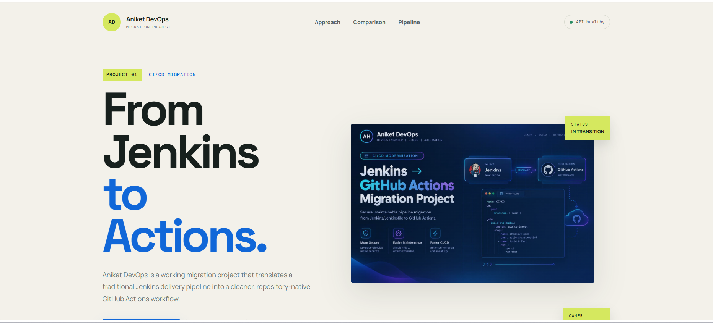
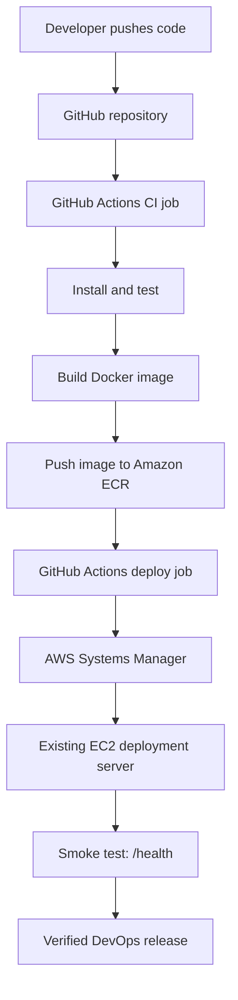
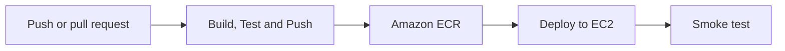

# jenkins-to-github-actions-migration

## CI/CD Pipeline Migration Lab

### Jenkins → GitHub Actions → Amazon ECR → Amazon EC2

**A production-style DevOps project that demonstrates how to migrate an end-to-end Jenkins pipeline to GitHub Actions while preserving the existing application and deployment target.**


**Jenkins → GitHub Actions migration project**

---

## Table of Contents

- [Quick Start (5-Minute Setup)](#quick-start-5-minute-setup)
- [Project Overview](#project-overview)
- [Architecture](#end-to-end-devops-architecture)
- [Prerequisites](#prerequisites)
- [GitHub Configuration Guide](#github-configuration-guide)
- [AWS IAM & OIDC Setup](#aws-iam--oidc-setup)
- [Local Development](#run-the-application-locally)
- [Testing](#testing-guide)
- [Deployment Verification](#deployment-verification-checklist)
- [Troubleshooting Guide](#real-world-troubleshooting-guide)
- [CI/CD Monitoring](#cicd-pipeline-monitoring--debugging)
- [Cost Estimation](#cost-estimation)
- [Contributing](#contributing--extensions)
- [FAQs](#frequently-asked-questions)
- [Security](#security-and-production-hardening)
- [Learning Outcomes](#devops-learning-outcomes)

---

## Quick Start (5-Minute Setup)

### Prerequisites
- GitHub account with a repository
- AWS account (free tier eligible)
- Node.js 22+ and npm
- Docker installed locally (optional for testing)

### Setup Steps

1. **Clone the repository**
   ```bash
   git clone https://github.com/anikethulule/jenkins-to-github-actions-migration.git
   cd jenkins-to-github-actions-migration
   ```

2. **Create AWS resources** (Terraform recommended)
   ```bash
   cd terraform
   terraform init
   terraform plan
   terraform apply
   ```

3. **Configure GitHub variables** (Settings → Secrets and variables → Variables)
   - `AWS_ACCOUNT_ID`: Your 12-digit AWS account ID
   - `EC2_INSTANCE_ID`: From Terraform output
   - `EC2_PUBLIC_IP`: From Terraform output

4. **Set up AWS OIDC** (see [AWS IAM & OIDC Setup](#aws-iam--oidc-setup) below)

5. **Run the workflow**
   - Push to `main` branch or create a pull request
   - GitHub Actions automatically starts
   - Monitor in **Actions** tab

6. **Verify deployment**
   ```bash
   curl http://<EC2_PUBLIC_IP>:8082/health
   ```

Done! Your pipeline is now migrated. 🎉

---

## Project overview

This **jenkins-to-github-actions-migration** project is a hands-on project for learning how to move pipeline orchestration from a Jenkins server into a repository-native GitHub Actions workflow.

The project keeps the delivery goal unchanged:

1. Check out the application.
2. Install dependencies and run automated tests.
3. Build a Docker image.
4. Authenticate to AWS.
5. Push the versioned image to Amazon ECR.
6. Deploy the container to the existing Amazon EC2 server.
7. Verify the release through the `/health` endpoint.

The application is a Node.js and Express migration dashboard. The same repository contains both pipeline implementations so that every Jenkins stage can be compared with its GitHub Actions replacement.

> **Migration principle:** change the CI/CD orchestrator—not the application, container contract, registry pattern, deployment server, or health-check strategy.

---

## Deployed application preview

The deployed application provides an interactive **jenkins-to-github-actions-migration** dashboard that visualizes the Jenkins-to-GitHub Actions workflow, pipeline stages, platform comparison and deployment status.



---

## What this DevOps project demonstrates

- A complete **Jenkins-to-GitHub Actions pipeline migration**.
- Jenkins declarative pipeline design using a `Jenkinsfile`.
- Repository-native CI/CD using `.github/workflows/cicd.yml`.
- Node.js dependency installation and automated testing.
- Docker image creation using an immutable commit-based tag.
- Secure GitHub-to-AWS authentication using OpenID Connect (OIDC).
- Amazon ECR authentication and image publishing.
- Agentless EC2 deployment through AWS Systems Manager.
- Container replacement on the existing deployment server.
- Post-deployment smoke testing with a real health endpoint.
- A practical stage-by-stage mapping between Jenkins and GitHub Actions.

---

## End-to-end DevOps architecture



### Platform responsibilities

| Layer | Technology | Responsibility |
|---|---|---|
| Source control | GitHub | Stores application and pipeline-as-code |
| Legacy automation | Jenkins | Runs the original declarative pipeline |
| Migrated automation | GitHub Actions | Runs CI and CD from the repository |
| Runtime | Node.js 22 | Runs the Express application and tests |
| Containerization | Docker | Packages the application consistently |
| Cloud authentication | GitHub OIDC + AWS IAM | Provides short-lived AWS credentials |
| Artifact registry | Amazon ECR | Stores immutable Docker images |
| Remote deployment | AWS Systems Manager | Executes deployment commands on EC2 without SSH |
| Deployment target | Amazon EC2 | Runs the application container |
| Verification | `curl` + `/health` | Confirms the deployed service is healthy |

---

## Pipeline workflow

### GitHub Actions workflow at a glance



The migrated workflow is defined in [`.github/workflows/cicd.yml`](.github/workflows/cicd.yml) and contains two dependent jobs.

### Job 1 — Build, Test and Push

Runs on a GitHub-hosted Ubuntu runner.

| Order | Workflow step | What happens |
|---:|---|---|
| 1 | Checkout | Downloads the repository onto the runner |
| 2 | Set up Node.js | Installs Node.js 22 |
| 3 | Install dependencies | Runs `npm install` |
| 4 | Run tests | Executes `npm test` |
| 5 | Configure AWS credentials | Assumes an IAM role through GitHub OIDC |
| 6 | Verify AWS identity | Runs `aws sts get-caller-identity` |
| 7 | Log in to ECR | Retrieves the registry URL and authenticates Docker |
| 8 | Build image | Builds the application image from the `Dockerfile` |
| 9 | Push image | Pushes the `${{ github.sha }}` tagged image to ECR |

### Job 2 — Deploy to Application EC2

The deployment job uses `needs: build-test-push`, so it starts only after the CI job succeeds.

| Order | Workflow step | What happens |
|---:|---|---|
| 1 | Configure AWS credentials | Assumes the deployment IAM role through OIDC |
| 2 | Send SSM command | Runs the deployment remotely on the EC2 instance |
| 3 | Authenticate to ECR | Allows the EC2 host to pull the private image |
| 4 | Pull image | Downloads the exact commit-tagged image |
| 5 | Replace container | Stops and removes `app`, then starts the new container |
| 6 | Wait for SSM | Blocks until the remote command completes |
| 7 | Smoke test | Calls `http://<EC2_PUBLIC_IP>:8082/health` |

### Image lifecycle

```text
Source commit
   → GitHub SHA image tag
   → Amazon ECR repository
   → EC2 Docker pull
   → app container
   → /health verification
```

Using `${{ github.sha }}` makes every GitHub Actions image traceable to the exact source commit that produced it.

---

## Jenkins-to-GitHub Actions mapping

The migration preserves the delivery logic while replacing Jenkins-specific constructs with GitHub-native equivalents.

| Jenkins | GitHub Actions | Migration meaning |
|---|---|---|
| `Jenkinsfile` | `.github/workflows/cicd.yml` | Pipeline as code remains in the repository |
| `pipeline {}` | Workflow YAML | Top-level pipeline definition |
| `agent any` | `runs-on: ubuntu-latest` | Selects the execution environment |
| `tools { nodejs 'nodejs22' }` | `actions/setup-node` | Installs Node.js 22 |
| `environment {}` | `env:` | Defines shared environment variables |
| `stages {}` | `jobs:` and `steps:` | Organizes the delivery lifecycle |
| `stage('Test')` | `Run tests` step | Runs the same automated test command |
| `checkout scm` | `actions/checkout` | Retrieves source code |
| `${BUILD_NUMBER}` | `${{ github.sha }}` | Creates a unique image version |
| Jenkins/AWS agent credentials | GitHub OIDC role assumption | Replaces persistent credentials with short-lived access |
| Shell deployment on agent | SSM command from deploy job | Separates the CI runner from the target server |
| `post { success/failure }` | Job status and logs | Reports workflow outcome |

### What changes and what remains unchanged

| Changes during migration | Remains unchanged |
|---|---|
| Pipeline orchestrator | Application source code |
| Pipeline syntax | Node.js runtime contract |
| Runner/agent model | Dockerfile and container port `8080` |
| Credential delivery mechanism | Amazon ECR image registry pattern |
| Remote deployment mechanism | Existing EC2 deployment server |
| Pipeline visibility and logs | Health endpoint and smoke-test goal |

> The sample Jenkins and GitHub Actions files currently use different ECR repository names. For a strict like-for-like migration, configure both pipelines to publish to the same approved ECR repository, or intentionally keep separate repositories during parallel validation.

---

## Repository structure

```text
jenkins-to-github-actions-migration/
├── .github/
│   └── workflows/
│       └── cicd.yml          # Migrated GitHub Actions CI/CD pipeline
├── public/
│   ├── app.js                # Interactive migration workflow UI
│   ├── index.html            # Migration dashboard
│   ├── styles.css            # Application styling
│   ├── devops-pipeline-migration-dashboard.png # Dashboard image asset
│   └── favicon.svg           # Transparent browser icon
├── .dockerignore             # Docker build exclusions
├── Dockerfile                # Node.js 22 production image
├── Jenkinsfile               # Original Jenkins pipeline
├── package.json              # Application scripts and dependencies
├── server.js                 # Express server and API endpoints
├── test.js                   # Automated health, UI and API tests
├── terraform/                # AWS infrastructure and EC2 bootstrap
│   ├── main.tf               # ECR, IAM, security group and EC2 resources
│   ├── variables.tf          # Infrastructure inputs
│   ├── outputs.tf            # Instance and ECR outputs
│   └── templates/jenkins-install.sh # Jenkins, Docker and AWS CLI setup
└── README.md                 # DevOps project documentation
```

---

## Technology stack

| Category | Tools |
|---|---|
| Application | Node.js 22, Express 4, HTML, CSS, JavaScript |
| Source control | Git and GitHub |
| CI/CD | Jenkins and GitHub Actions |
| Container platform | Docker |
| Cloud | AWS IAM, STS, ECR, Systems Manager and EC2 |
| Testing | Node.js test script and HTTP smoke test |
| DevOps practices | Pipeline as code, immutable tagging, OIDC, remote deployment and health validation |

---

## Prerequisites

### For local execution

- Node.js 22+
- npm
- Docker (optional, for container testing)

### For Jenkins execution

- Jenkins controller and an available agent
- Node.js tool configured in Jenkins as `nodejs22`
- Docker installed and accessible to the Jenkins agent
- AWS CLI configured on the agent
- AWS permissions for STS and ECR
- Access to the deployment Docker host used by the Jenkins pipeline

### For GitHub Actions execution

- A GitHub repository containing this project
- An Amazon ECR repository named `jenkins-migration-demo` (or update `.github/workflows/cicd.yml`)
- A GitHub OIDC provider configured in AWS IAM (see [AWS IAM & OIDC Setup](#aws-iam--oidc-setup))
- An IAM role named `GithubActionsMigrationRole` with proper trust policy and permissions
- An EC2 deployment instance managed by AWS Systems Manager
- Docker and AWS CLI installed on the EC2 instance
- An EC2 instance profile with SSM and ECR pull permissions
- Network access to the application on port `8082` for the smoke test
- GitHub repository variables: `AWS_ACCOUNT_ID`, `EC2_INSTANCE_ID`, `EC2_PUBLIC_IP`

### For Terraform provisioning

- Terraform 1.6+
- AWS CLI configured with permissions to create ECR, IAM, security group and EC2 resources
- An existing VPC, subnet and EC2 key pair
- An Ubuntu 24.04-compatible AWS region and an available public subnet

---

## GitHub Configuration Guide

### Step 1: Create Repository Variables

GitHub Actions workflows access configuration through repository variables (not secrets, since they're not sensitive).

#### Navigate to Variables

1. Go to your repository: `https://github.com/anikethulule/jenkins-to-github-actions-migration`
2. Click **Settings** (top right)
3. In the left sidebar, click **Secrets and variables** → **Actions**
4. Click **Variables** tab

#### Add `AWS_ACCOUNT_ID`

| Field | Value |
|---|---|
| **Name** | `AWS_ACCOUNT_ID` |
| **Value** | Your 12-digit AWS account ID (e.g., `072471709665`) |

1. Click **New repository variable**
2. Enter the name and value
3. Click **Add variable**

#### Add `EC2_INSTANCE_ID`

| Field | Value |
|---|---|
| **Name** | `EC2_INSTANCE_ID` |
| **Value** | Your EC2 instance ID (e.g., `i-04e5b81cd7589ac94`) |

Find this in **AWS Console → EC2 → Instances** or from Terraform output:
```bash
cd terraform
terraform output ec2_instance_id
```

#### Add `EC2_PUBLIC_IP`

| Field | Value |
|---|---|
| **Name** | `EC2_PUBLIC_IP` |
| **Value** | Your EC2 public IP address (e.g., `15.207.223.224`) |

Find this in **AWS Console → EC2 → Instances** or from Terraform output:
```bash
cd terraform
terraform output ec2_public_ip
```

### Step 2: Verify Variables Are Set

Add this temporary step to your workflow to confirm variables are available:

```yaml
- name: Verify GitHub Variables
  run: |
    echo "AWS_ACCOUNT_ID is set: ${{ vars.AWS_ACCOUNT_ID != '' }}"
    echo "EC2_INSTANCE_ID is set: ${{ vars.EC2_INSTANCE_ID != '' }}"
    echo "EC2_PUBLIC_IP is set: ${{ vars.EC2_PUBLIC_IP != '' }}"
```

Run a workflow and check the logs. All three should show `true`.

### Step 3: Create ECR Repository

The workflow pushes images to an ECR repository. Create it:

1. Go to **AWS Console → ECR → Repositories**
2. Click **Create repository**
3. **Repository name:** `jenkins-migration-demo`
4. **Visibility:** Private
5. Click **Create repository**

Note the repository URI (e.g., `072471709665.dkr.ecr.ap-south-1.amazonaws.com/jenkins-migration-demo`) and this ECR will be created through terraform code only.

---

## AWS IAM & OIDC Setup

This section walks through setting up GitHub OIDC authentication in AWS so GitHub Actions can assume a role without storing long-lived credentials.

### Step 1: Create the OIDC Provider in AWS

The GitHub OIDC provider must be registered in your AWS account.

#### Using AWS Console

1. Go to **AWS Console → IAM → Identity providers**
2. Click **Add provider**
3. Select **OpenID Connect**
4. Fill in:
   | Field | Value |
   |---|---|
   | **Provider URL** | `https://token.actions.githubusercontent.com` |
   | **Audience** | `sts.amazonaws.com` |
   
5. Click **Add provider**

#### Using AWS CLI

```bash
aws iam create-open-id-connect-provider \
  --url https://token.actions.githubusercontent.com \
  --client-id-list sts.amazonaws.com 
```

#### Verify It Was Created

```bash
aws iam list-open-id-connect-providers
```

Should output:
```json
{
    "OpenIDConnectProviderList": [
        {
            "Arn": "arn:aws:iam::072471709665:oidc-provider/token.actions.githubusercontent.com"
        }
    ]
}
```

### Step 2: Create the IAM Role

The role that GitHub Actions will assume.

#### Using AWS Console

1. Go to **AWS Console → IAM → Roles**
2. Click **Create role**
3. Select **Custom trust policy**
4. Paste this trust policy:

```json
{
    "Version": "2012-10-17",
    "Statement": [
        {
            "Effect": "Allow",
            "Principal": {
                "Federated": "arn:aws:iam::072471709665:oidc-provider/token.actions.githubusercontent.com"
            },
            "Action": "sts:AssumeRoleWithWebIdentity",
            "Condition": {
                "StringEquals": {
                    "token.actions.githubusercontent.com:aud": "sts.amazonaws.com"
                },
                "StringLike": {
                    "token.actions.githubusercontent.com:sub": "repo:anikethulule@129358060/jenkins-to-github-actions-migration@*"
                }
            }
        }
    ]
}
```

**⚠️ IMPORTANT:** Replace:
- `072471709665` with your AWS account ID
- `anikethulule@129358060` with your GitHub username and user ID
- `jenkins-to-github-actions-migration` with your repository name

5. Click **Next**
6. **Role name:** `GithubActionsMigrationRole` (note the capitalization)
7. Click **Create role**

#### Using AWS CLI

```bash
cat > trust-policy.json << 'EOF'
{
    "Version": "2012-10-17",
    "Statement": [
        {
            "Effect": "Allow",
            "Principal": {
                "Federated": "arn:aws:iam::072471709665:oidc-provider/token.actions.githubusercontent.com"
            },
            "Action": "sts:AssumeRoleWithWebIdentity",
            "Condition": {
                "StringEquals": {
                    "token.actions.githubusercontent.com:aud": "sts.amazonaws.com"
                },
                "StringLike": {
                    "token.actions.githubusercontent.com:sub": "repo:anikethulule@129358060/jenkins-to-github-actions-migration@*"
                }
            }
        }
    ]
}
EOF

aws iam create-role \
  --role-name GithubActionsMigrationRole \
  --assume-role-policy-document file://trust-policy.json
```

### Step 3: Attach Permissions to the Role

The role needs permissions to:
- Authenticate to ECR
- Send SSM commands to EC2
- Push images to ECR

#### Attach ECR Permissions

```bash
aws iam attach-role-policy \
  --role-name GithubActionsMigrationRole \
  --policy-arn arn:aws:iam::aws:policy/AmazonEC2ContainerRegistryPowerUser
```

#### Attach SSM Permissions

```bash
aws iam attach-role-policy \
  --role-name GithubActionsMigrationRole \
  --policy-arn arn:aws:iam::aws:policy/AmazonSSMFullAccess
```

Or use a custom least-privilege policy:

```bash
cat > ssm-ecr-policy.json << 'EOF'
{
    "Version": "2012-10-17",
    "Statement": [
        {
            "Effect": "Allow",
            "Action": [
                "ssm:SendCommand",
                "ssm:GetCommandInvocation"
            ],
            "Resource": "*"
        }
    ]
}
EOF

aws iam put-role-policy \
  --role-name GithubActionsMigrationRole \
  --policy-name GithubActionsMigrationPolicy \
  --policy-document file://ssm-ecr-policy.json
```

### Step 4: Verify the Setup

#### Check the Role

```bash
aws iam get-role --role-name GithubActionsMigrationRole
```

#### Check Attached Policies

```bash
aws iam list-attached-role-policies --role-name GithubActionsMigrationRole
```

#### Check Trust Policy

```bash
aws iam get-role --role-name GithubActionsMigrationRole --query 'Role.AssumeRolePolicyDocument'
```

### Step 5: Update Workflow Role Reference (if needed)

In `.github/workflows/cicd.yml`, verify the role ARN matches:

```yaml
role-to-assume: arn:aws:iam::${{ vars.AWS_ACCOUNT_ID }}:role/GithubActionsMigrationRole
```

---

## Run the application locally

```bash
git clone https://github.com/<YOUR_ACCOUNT>/<YOUR_REPOSITORY>.git
cd jenkins-to-github-actions-migration
npm install
npm test
npm start
```

Open:

```text
http://localhost:8080
```

### Application endpoints

| Endpoint | Purpose | Expected result |
|---|---|---|
| `/` | Migration dashboard | HTML page |
| `/health` | Runtime health check | HTTP 200 with `status: UP` |
| `/api/migration` | Migration metadata | JSON describing the demo stages |

Example health check:

```bash
curl http://localhost:8080/health
```

---

## Run with Docker

Build the image:

```bash
docker build -t anikethulule/migration-demo:local .
```

Start the container:

```bash
docker run --rm --name migration-demo -p 8081:8080 \
  anikethulule/migration-demo:local
```

Verify it:

```bash
curl http://localhost:8081/health
```

The Docker image runs as the non-root `node` user and exposes application port `8080`.

---

## Testing Guide

### Run Tests Locally

```bash
npm install
npm test
```

### What the Tests Check

The test suite (`test.js`) validates:

1. **Server startup** - Express server is listening
2. **Health endpoint** - `/health` returns `status: UP`
3. **Dashboard HTML** - `/` serves the migration dashboard
4. **API endpoint** - `/api/migration` returns valid JSON
5. **Port configuration** - Application runs on port 8080

### Interpret Test Results

**Success output:**
```
✓ Health check passed
✓ Dashboard loaded
✓ API endpoints working
All tests passed!
```

**Failure output:**
```
✗ Health check failed: Connection refused
```

Common failures:
- Port 8080 already in use
- Node.js version mismatch
- Missing dependencies (`npm install`)

### Debug Tests

Run with verbose output:

```bash
npm test -- --verbose
```

Check logs:

```bash
node server.js  # Start server manually
# In another terminal:
curl http://localhost:8080/health
```

---

## Deployment Verification Checklist

After the GitHub Actions workflow completes, use this checklist to confirm the deployment succeeded.

### ✅ Pre-Deployment Checks

- [ ] GitHub Actions workflow completed successfully (green checkmark)
- [ ] No errors in the workflow logs
- [ ] ECR image was pushed (verify in AWS Console → ECR)
- [ ] Image tag matches the GitHub commit SHA

### ✅ AWS Checks

```bash
# Verify ECR image exists
aws ecr describe-images \
  --repository-name jenkins-migration-demo \
  --region ap-south-1

# Verify EC2 instance is running
aws ec2 describe-instances \
  --instance-ids i-04e5b81cd7589ac94 \
  --region ap-south-1
```

### ✅ EC2 Instance Checks

SSH into the EC2 instance:

```bash
ssh -i /path/to/key.pem ubuntu@<EC2_PUBLIC_IP>
```

Check Docker containers:

```bash
docker ps -a
docker logs app
```

Check application health:

```bash
curl http://localhost:8082/health
```

Check port mapping:

```bash
docker port app
```

### ✅ Application Checks

From your local machine:

```bash
# Verify the application is accessible
curl -v http://<EC2_PUBLIC_IP>:8082/health

# Should respond with:
# HTTP/1.1 200 OK
# {"status":"UP"}
```

### ✅ Final Validation

1. Open browser: `http://<EC2_PUBLIC_IP>:8082`
2. Dashboard should load
3. No application errors in browser console

---

## Real-World Troubleshooting Guide

This section addresses the exact errors you may encounter and how to fix them.

### Error: "Not authorized to perform sts:AssumeRoleWithWebIdentity"

**When this happens:** GitHub Actions tries to assume the role but fails.

**Root causes:**
1. Trust policy is missing or incorrect
2. Role doesn't exist or has a typo in the name
3. OIDC provider doesn't exist

**Fix:**

1. Verify the role exists and name is correct (case-sensitive):
   ```bash
   aws iam get-role --role-name GithubActionsMigrationRole
   ```

2. Verify the OIDC provider exists:
   ```bash
   aws iam list-open-id-connect-providers
   ```

3. Verify the trust policy:
   ```bash
   aws iam get-role --role-name GithubActionsMigrationRole \
     --query 'Role.AssumeRolePolicyDocument'
   ```

4. Trust policy should contain:
   ```json
   "Federated": "arn:aws:iam::072471709665:oidc-provider/token.actions.githubusercontent.com"
   ```

5. Update workflow to match exact role name:
   ```yaml
   role-to-assume: arn:aws:iam::${{ vars.AWS_ACCOUNT_ID }}:role/GithubActionsMigrationRole
   ```

### Error: "ecr:GetAuthorizationToken denied"

**When this happens:** Docker login to ECR fails.

**Root cause:** The `GithubActionsMigrationRole` doesn't have ECR permissions.

**Fix:**

Attach ECR policy to the role:

```bash
aws iam attach-role-policy \
  --role-name GithubActionsMigrationRole \
  --policy-arn arn:aws:iam::aws:policy/AmazonEC2ContainerRegistryPowerUser
```

Or attach a custom policy with `ecr:GetAuthorizationToken` permission.

### Error: Role name case-sensitivity issue

**When this happens:** "GitHubActionsMigrationRole" vs "GithubActionsMigrationRole" mismatch.

**Root cause:** AWS role names are case-sensitive, but the workflow uses wrong casing.

**Fix:**

Option 1: Rename the role in AWS to match the workflow
```bash
# Create new role with correct name
aws iam create-role \
  --role-name GitHubActionsMigrationRole \
  --assume-role-policy-document file://trust-policy.json

# Copy policies from old role
# Delete old role
```

Option 2: Update workflow to match the role name exactly:
```yaml
role-to-assume: arn:aws:iam::${{ vars.AWS_ACCOUNT_ID }}:role/GithubActionsMigrationRole
```

**Verify role name:**
```bash
aws iam list-roles --query "Roles[*].RoleName" | grep -i github
```

### Error: "Docker permission denied while trying to connect to the Docker daemon"

**When this happens:** User doesn't have Docker permissions on EC2.

**Root cause:** User is not in the `docker` group.

**Fix:**

On EC2 instance:

```bash
# Add user to docker group
sudo usermod -aG docker ubuntu

# Log out and back in, or:
newgrp docker

# Verify
docker ps
```

### Error: "Cannot connect to ECR" or "Pull access denied"

**When this happens:** EC2 cannot pull the image from ECR.

**Root causes:**
1. EC2 instance role doesn't have ECR permissions
2. Image doesn't exist in ECR
3. Region mismatch

**Fix:**

1. Verify EC2 instance role has ECR permissions:
   ```bash
   aws iam get-role --role-name ApplicationEC2Role \
     --query 'Role.AssumeRolePolicyDocument'
   ```

2. Attach ECR pull policy:
   ```bash
   aws iam attach-role-policy \
     --role-name ApplicationEC2Role \
     --policy-arn arn:aws:iam::aws:policy/AmazonEC2ContainerRegistryReadOnly
   ```

3. Verify image exists:
   ```bash
   aws ecr describe-images \
     --repository-name jenkins-migration-demo \
     --region ap-south-1
   ```

4. Test pull manually on EC2:
   ```bash
   ssh -i /path/to/key.pem ubuntu@<EC2_PUBLIC_IP>
   aws ecr get-login-password --region ap-south-1 | \
     docker login --username AWS --password-stdin \
     072471709665.dkr.ecr.ap-south-1.amazonaws.com
   docker pull 072471709665.dkr.ecr.ap-south-1.amazonaws.com/jenkins-migration-demo:latest
   ```

---

## CI/CD Pipeline Monitoring & Debugging

### View Workflow Runs

1. Go to your repository
2. Click **Actions** tab
3. View the list of workflow runs
4. Click a run to see details

### View Workflow Logs

1. Click on a workflow run
2. Click the job name (e.g., "build-test-push")
3. Expand each step to see logs

### Common Log Patterns

**Success:**
```
✓ All steps passed
✓ Image pushed to ECR
✓ Deployment completed
```

**Failure points:**
- `npm install` - dependency issues
- `npm test` - test failures
- `docker build` - Dockerfile issues
- `aws ecr get-login-password` - authentication issues
- `docker push` - registry issues
- `aws ssm send-command` - deployment issues

### Debug a Failed Workflow

1. **Check the exact step that failed** - look for red ✗
2. **Expand that step** to see full error message
3. **Check variables** - ensure `AWS_ACCOUNT_ID`, etc. are set
4. **Check permissions** - role has required IAM policies
5. **Check resources** - ECR repo exists, EC2 instance is running
6. **Re-run the workflow** - temporary issues sometimes resolve on retry

**Re-run workflow:**
1. Click the workflow run
2. Click **Re-run all jobs** button (top right)

### Enable Debug Logging

Add this to your workflow for more verbose output:

```yaml
- name: Configure AWS credentials
  uses: aws-actions/configure-aws-credentials@v6
  with:
    role-to-assume: arn:aws:iam::${{ vars.AWS_ACCOUNT_ID }}:role/GithubActionsMigrationRole
    aws-region: ap-south-1
    debug: true  # Enable debug logging
```

---

## Provision Jenkins with Terraform

The Terraform configuration provisions an Amazon ECR repository, an EC2 IAM instance profile, a security group, and an Ubuntu 24.04 EC2 instance. The instance bootstrap installs Java 21, Docker, AWS CLI v2, and Jenkins, then starts Docker and Jenkins.

From the Terraform directory:

```bash
cd terraform
terraform init
terraform validate
terraform plan
terraform apply
```

Review `terraform/terraform.tfvars` before applying. The current example targets `ap-south-1`, uses a `t3.medium` instance, and expects an existing VPC, subnet, and EC2 key pair. Restrict `allowed_ssh_cidr` and `allowed_web_cidr` to trusted ranges for real environments.

After provisioning:

```bash
terraform output ec2_public_ip
terraform output jenkins_url
ssh -i /path/to/key.pem ubuntu@<EC2_PUBLIC_IP>
sudo cloud-init status --wait
which java
which docker
which aws
which jenkins
sudo systemctl status docker jenkins
```

The bootstrap output is written to `/var/log/jenkins-bootstrap.log`. The script installs AWS CLI v2 from the official AWS installer because `awscli` is not available from the Ubuntu 24.04 apt sources used by this image.

To remove the Terraform-managed resources:

```bash
terraform destroy
```
---

### How to Contribute

1. Fork the repository
2. Create a feature branch: `git checkout -b feature/your-feature`
3. Make your changes
4. Test locally: `npm test`
5. Commit: `git commit -am 'Add feature'`
6. Push: `git push origin feature/your-feature`
7. Create a Pull Request

---

## Security and production hardening

This project already demonstrates several strong DevOps security practices:

- Short-lived AWS credentials through OIDC.
- No static AWS keys stored in the repository.
- Least-privilege `contents: read` repository permission.
- Non-root application user inside the Docker image.
- Immutable Git SHA image tags.
- Agentless remote execution through Systems Manager.
- Automated post-deployment health verification.

Recommended production enhancements:

- Restrict the IAM trust policy to the exact repository and protected branch.
- Scope ECR and SSM permissions to named resources.
- Deploy only after a successful push to the protected `main` branch.
- Add GitHub Environment approvals for production.
- Pin actions to reviewed commit SHAs where required by policy.
- Add dependency, secret, source, filesystem and container-image scanning.
- Record image digests and generate an SBOM.
- Add concurrency controls to prevent overlapping deployments.
- Add timeouts, retry rules and deployment notifications.
- Place the application behind HTTPS and a load balancer.

> The web dashboard visualizes a conceptual **Security** stage. The current workflow does not execute a scanner yet. Add tools such as Gitleaks, SonarQube and Trivy before treating that visual stage as implemented.

### Pull-request deployment note

The current workflow listens to both `push` and `pull_request` events. In a production repository, keep pull requests validation-only by adding a deployment condition such as:

```yaml
deploy:
  if: github.event_name == 'push' && github.ref == 'refs/heads/main'
```

This prevents unmerged pull-request code from reaching the deployment environment.

---

## DevOps learning outcomes

After completing this **jenkins-to-github-actions-migration** project, you should be able to explain and demonstrate:

- How Jenkins concepts translate into GitHub Actions concepts.
- Why CI and CD should be separated into dependent jobs.
- How OIDC removes the need for stored cloud access keys.
- How ECR registry output is passed into Docker build and push commands.
- Why immutable image tags improve traceability and rollback.
- How SSM enables remote deployment without direct SSH from CI.
- Why deployment completion and application health are different checks.
- How to migrate a pipeline incrementally without changing the application server.

---

## License

This project is provided as-is for educational purposes.

## Support

For issues, questions, or contributions, please open a GitHub Issue or Pull Request.

---

**Last Updated:** September 2026
**Project Status:** Active
**Maintained by:** [Aniket Hulule](https://github.com/anikethulule)
